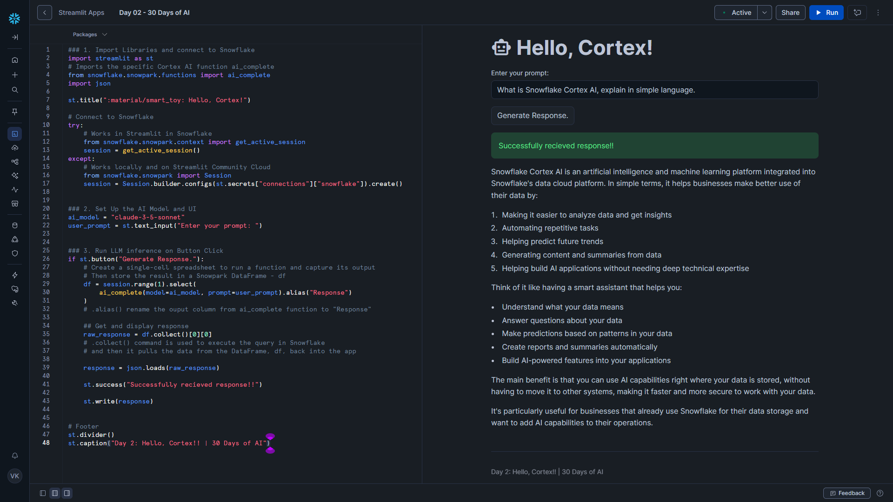

# Day 02 – Hello, Cortex

This project is part of the **#30DaysOfAI** challenge by Streamlit.

## Goal

Run a Large Language Model (LLM) directly inside **Snowflake** using **Snowflake Cortex**, and interact with it through a Streamlit app.

## What this app does

- Accepts a user prompt via a Streamlit UI
- Sends the prompt to a Snowflake Cortex LLM (`claude-3-5-sonnet`)
- Retrieves the AI-generated response
- Displays the result back to the user

## Tech Stack

- Python
- Streamlit
- Snowflake Snowpark
- Snowflake Cortex (LLM)

## How it works

- Uses `get_active_session()` when running in **Streamlit in Snowflake**
- Calls the `ai_complete()` Snowpark function to run LLM inference
- The LLM response is returned as JSON and parsed before display

## Key Learning

This demonstrates how AI models can run **directly inside a data platform**, removing the need for external LLM APIs and simplifying AI app architecture.

## Screenshot

