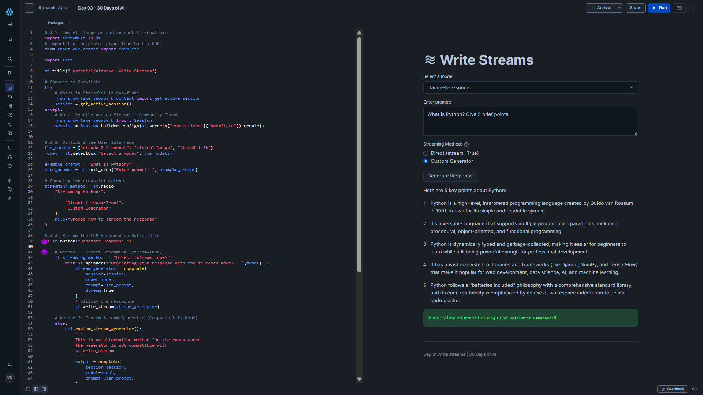

# Day 03 – Write Streams

This project is part of the **#30DaysOfAI** challenge by Streamlit.

## Goal

Stream responses from a Snowflake Cortex LLM in real time using the **Cortex Complete Python API**.

## What this app does

- Lets users select a Snowflake-supported LLM
- Accepts a custom prompt
- Streams the AI response token-by-token in real time
- Demonstrates two streaming approaches for flexibility and reliability

## Tech Stack

- Python
- Streamlit
- Snowflake Snowpark
- Snowflake Cortex (Complete API)

## Streaming Methods Demonstrated

### 1. Direct Streaming (`stream=True`)

Uses built-in streaming support from the Cortex Complete API.  
Best for simple use cases and fast implementation.

### 2. Custom Generator (Compatibility Mode)

Manually yields chunks from the response.  
More reliable for complex workflows such as chat history and advanced UI logic.

## Key Learning

Streaming improves user experience by showing responses as they are generated, making AI apps feel faster and more interactive.

## Screenshot

