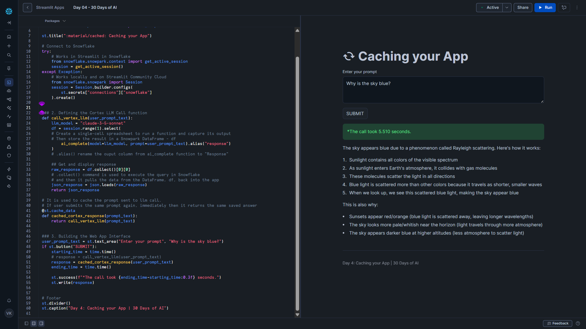

# Day 04 – Caching your App

This project is part of the **#30DaysOfAI** challenge by Streamlit.

## Goal

Build a Streamlit application that calls a **Snowflake Cortex LLM** and uses **Streamlit caching** to optimize performance for repeated prompts.

## What this app does

- Accepts a user prompt via a Streamlit UI
- Sends the prompt to a Snowflake Cortex LLM (Claude 3.5 Sonnet)
- Measures and displays response time
- Caches identical prompts to return instant responses on repeat calls

## Tech Stack

- Python
- Streamlit
- Snowflake Snowpark
- Snowflake Cortex (LLM Inference)
- Claude 3.5 Sonnet

## Key Concept: Caching with Streamlit

This app uses `@st.cache_data` to store LLM responses based on the input prompt.

- First-time prompt → LLM is executed (slower)
- Same prompt again → Cached response is returned instantly
- Any prompt change → Cache miss → LLM runs again

This helps reduce:

- Latency
- Compute cost
- Redundant LLM inference calls

## How it Works

### 1. Environment-Aware Snowflake Connection

The app automatically detects whether it is running:

- In Streamlit in Snowflake (SiS)
- Locally
- On Streamlit Community Cloud

and connects to Snowflake accordingly.

### 2. Cached Cortex LLM Call

The LLM call is wrapped inside a cached function so repeated prompts reuse stored results instead of triggering new inference calls.

### 3. Performance Measurement

The app measures request duration to clearly show the difference between cached and uncached responses.

## Key Learning

Caching is a critical optimization technique for production AI apps, improving both user experience and cost efficiency when working with LLMs.

## Screenshot

