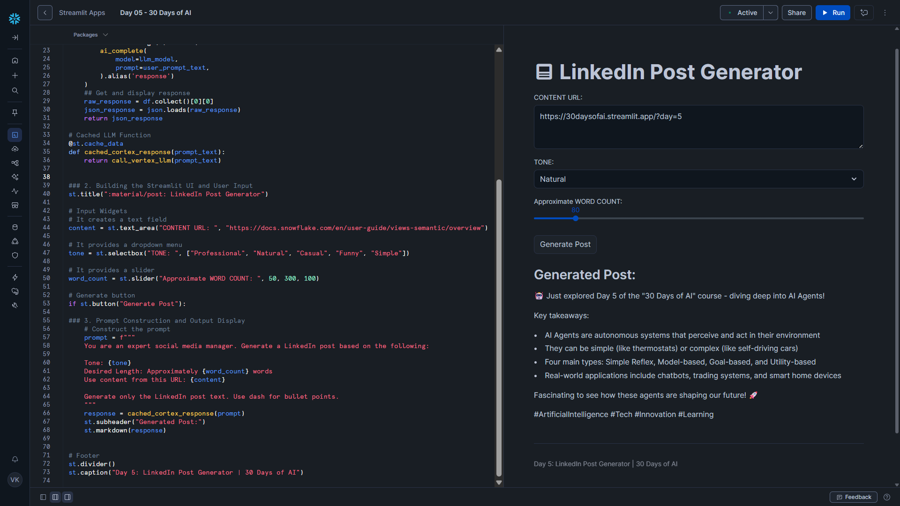

# Day 05 – LinkedIn Post Generator

This project is part of the **#30DaysOfAI** challenge by Streamlit.

## Goal

Build a Streamlit web application that generates a **LinkedIn post** using a **Snowflake Cortex LLM**, based on user-defined inputs such as content URL, tone, and desired length.

## What this app does

- Accepts a content URL as input
- Allows users to choose the tone of the post
- Lets users control the approximate word count
- Calls a Snowflake Cortex LLM (Claude 3.5 Sonnet)
- Displays a ready-to-use LinkedIn post in the UI
- Uses caching to optimize repeated prompt generation

## Tech Stack

- Python
- Streamlit
- Snowflake Snowpark
- Snowflake Cortex (LLM Inference)
- Claude 3.5 Sonnet

## Key Concept: Prompt-Based Content Generation

This app demonstrates how structured prompts combined with user input can generate high-quality, professional social media content using LLMs.

The prompt dynamically includes:

- Tone (Professional, Casual, Funny, etc.)
- Desired post length
- Reference content URL
- Clear formatting instructions for LinkedIn-ready output

## How it Works

### 1. Environment-Aware Snowflake Connection

The app automatically detects whether it is running:

- In Streamlit in Snowflake (SiS)
- Locally
- On Streamlit Community Cloud

and connects to Snowflake accordingly.

### 2. Cached Cortex LLM Call

The LLM call is wrapped with `@st.cache_data` to cache responses for identical prompts, reducing repeated inference calls and improving performance.

### 3. Streamlit UI for Content Control

Users interact with:

- A text input for content URL
- A dropdown for tone selection
- A slider for word count
- A button to generate the LinkedIn post

The generated post is rendered using Markdown for clean formatting.

## Key Learning

LLMs can be effectively used for real-world content generation tasks by combining:

- Well-structured prompts
- User-controlled inputs
- Caching for performance and cost efficiency

## Screenshot

