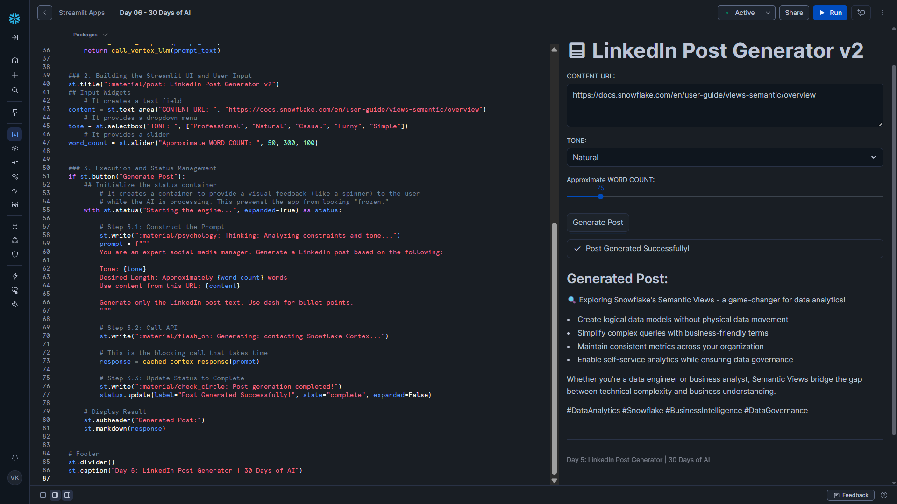

# Day 06 – Status UI for Long-Running Tasks

This project is part of the **#30DaysOfAI** challenge by Streamlit.

## Goal

Enhance the LinkedIn Post Generator by adding a **status-based UI** that provides real-time feedback during long-running Snowflake Cortex LLM calls.

## What this app does

- Accepts user input for content URL, tone, and word count
- Generates a LinkedIn post using Snowflake Cortex (Claude 3.5 Sonnet)
- Displays step-by-step execution progress using Streamlit status UI
- Prevents the app from appearing frozen during long-running tasks
- Uses caching to optimize repeated prompt execution

## Tech Stack

- Python
- Streamlit
- Snowflake Snowpark
- Snowflake Cortex (LLM Inference)
- Claude 3.5 Sonnet

## Key Concept: Status UI for Long-Running Tasks

LLM calls can take several seconds. Without feedback, users may think the app is stuck.

This app uses `st.status()` to:

- Show progress messages
- Indicate different execution stages
- Clearly signal when the task is completed

## How it Works

### 1. Environment-Aware Snowflake Connection

The app automatically connects to Snowflake whether it runs:

- In Streamlit in Snowflake (SiS)
- Locally
- On Streamlit Community Cloud

### 2. Cached Cortex LLM Call

The LLM call is wrapped using `@st.cache_data`, ensuring:

- Faster responses for repeated prompts
- Reduced compute usage
- Better user experience

### 3. Status-Based Execution Flow

The app uses a status container to visually represent:

- Prompt analysis
- LLM request execution
- Successful completion

Each step updates the UI so users understand what is happening in real time.

## Key Learning

For production-grade AI apps:

- Long-running tasks must provide UI feedback
- Status indicators dramatically improve perceived performance
- Combining caching + status UI results in smoother, more reliable user experiences

## Screenshot

