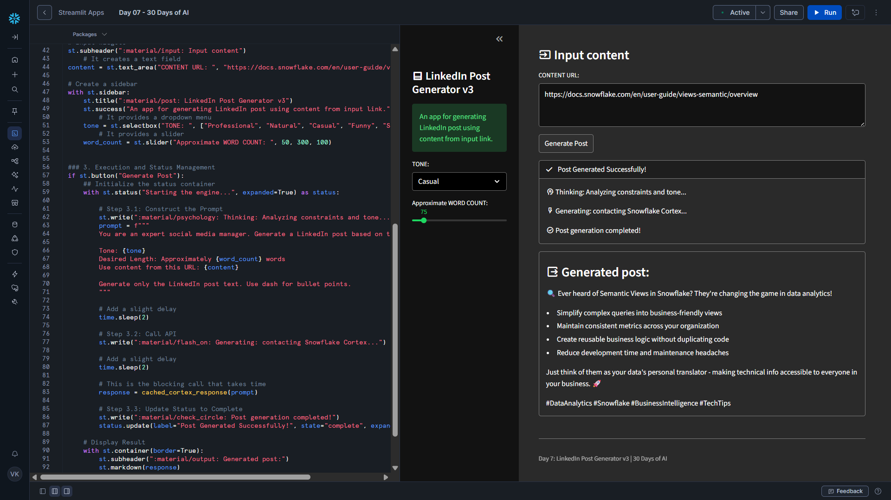

# Day 07 – Theming and Layout

This project is part of the **#30DaysOfAI** challenge by Streamlit.

## Goal

Transform a functional AI app into a **polished, professional UI** using Streamlit’s theming and layout features, including dark mode, sidebar navigation, and structured output containers.

## What this app does

- Generates LinkedIn posts using Snowflake Cortex (Claude 3.5 Sonnet)
- Organizes inputs using a clean sidebar layout
- Applies a custom dark theme using Streamlit configuration
- Displays progress using a status UI for long-running tasks
- Presents AI output in a visually grouped container

## Tech Stack

- Python
- Streamlit
- Snowflake Snowpark
- Snowflake Cortex (LLM Inference)
- Claude 3.5 Sonnet

## Key Concept: Theming & Layout

A great AI app is not just about functionality — **visual design and usability matter**.

This project focuses on:

- Dark mode theming
- Sidebar-based navigation
- Visual hierarchy for inputs, progress, and outputs
- Consistent branding using Streamlit configuration

## How it Works

### 1. Dark Mode & Global Styling

The app uses a `.streamlit/config.toml` file to define:

- Dark theme base
- Custom primary accent color
- Rounded buttons
- Sidebar-specific styling

This applies a consistent look across the entire app without writing CSS.

### 2. Sidebar-Based Layout

Configuration inputs such as:

- Tone
- Word count

are moved into the sidebar, keeping the main area focused on:

- Content input
- Progress status
- Generated output

This improves clarity and usability.

### 3. Status UI for Long-Running Tasks

The app uses `st.status()` to:

- Show real-time progress messages
- Indicate different execution stages
- Clearly signal completion

This prevents the UI from appearing frozen during LLM calls.

### 4. Output Grouping

The generated LinkedIn post is displayed inside a bordered container, creating a clear separation between:

- Inputs
- Processing steps
- Final output

## Key Learning

Production-ready AI apps require:

- Thoughtful layout design
- Clear user feedback during processing
- Consistent visual theming
- Separation of configuration and results

Good UI dramatically improves trust and usability.

## Screenshot

