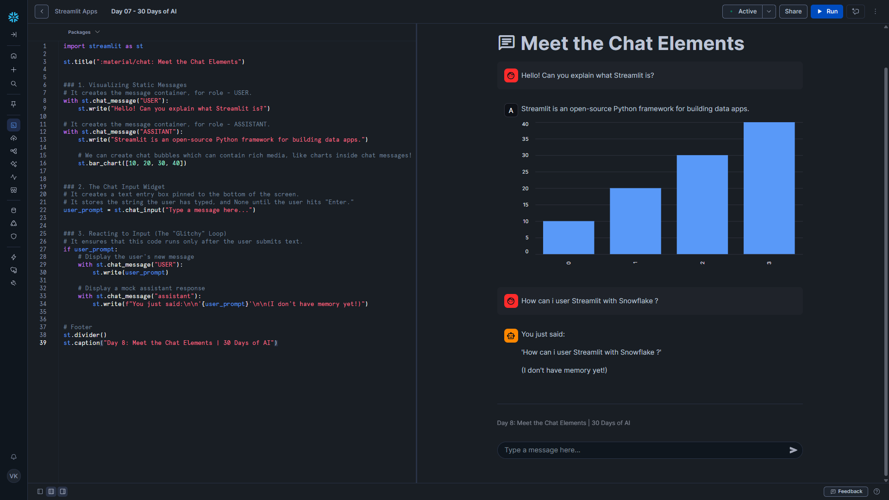

# Day 08 – Meet the Chat Elements

This project is part of the **#30DaysOfAI** challenge by Streamlit.

## Goal

Introduce **chat-based UI elements** in Streamlit and build the **visual foundation of a chatbot** using chat messages and chat input — without memory or LLM integration yet.

## What this app does

* Displays chat-style message bubbles for user and assistant
* Demonstrates rich content inside chat messages (charts inside bubbles)
* Uses a pinned chat input at the bottom of the screen
* Echoes user input back as a mock assistant response
* Highlights why session state is required for chat memory

## Tech Stack

* Python
* Streamlit

## Key Concept: Chat-Based UI

Traditional Streamlit apps follow a **linear flow**:

Input → Process → Output

Chat apps are different. They require:

* Persistent conversation history
* Role-based message rendering
* Input that feels natural and continuous

This project focuses **only on the UI layer**, creating the visual skeleton of a chatbot.

## How it Works

### 1. Chat Message Containers

The app uses `st.chat_message()` to render chat bubbles.

* `"user"` messages appear on the right
* `"assistant"` messages appear on the left
* Streamlit automatically assigns avatars and alignment

Chat messages can contain:

* Text
* Charts
* Images
* Dataframes

This makes chat interfaces powerful and flexible.

---

### 2. Chat Input Widget

The app uses `st.chat_input()` to create a text box fixed at the bottom of the screen.

* Automatically handles layout
* Returns input only when the user presses Enter
* Feels like a real chat interface

This replaces traditional buttons and text inputs for conversational apps.

---

### 3. Reactive Execution (The “Glitch”)

When the user submits a message:

* The message appears instantly
* A mock assistant response is generated

However, previous messages disappear.

This happens because:

* Streamlit reruns the script on every interaction
* No conversation history is stored yet

This behavior clearly demonstrates **why session state is essential** for chat applications.

## Key Learning

Chat UIs require a mindset shift:

* You must manage state explicitly
* UI is rerendered on every interaction
* Memory does not exist by default

This project sets the stage for:

* Persistent conversations
* LLM-powered chatbots
* Retrieval-Augmented Generation (RAG)

Session State is the missing piece — and that’s coming next.

## Screenshot

