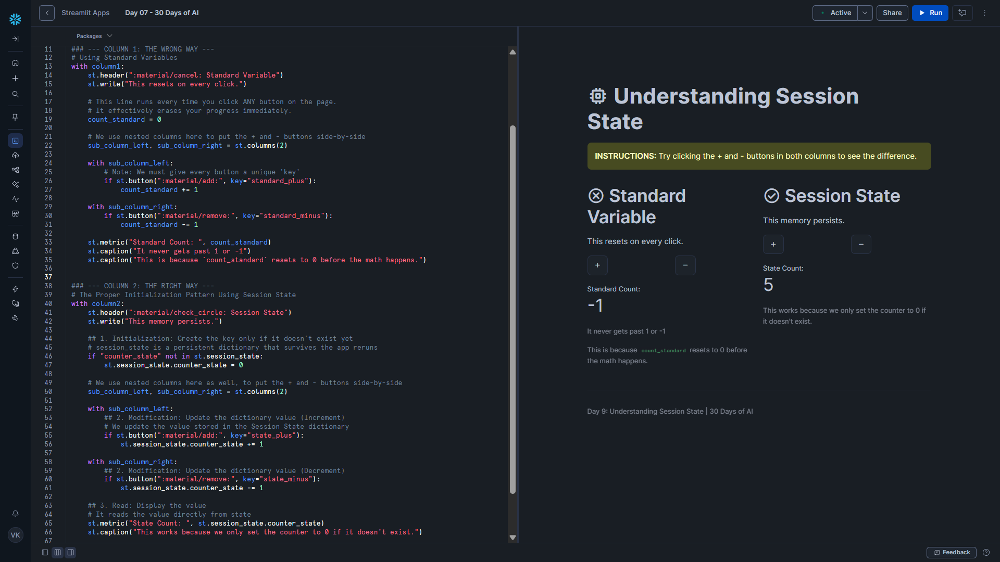

# Day 09 – Understanding Session State

This project is part of the **#30DaysOfAI** challenge by Streamlit.

## Goal

Understand and solve the **“amnesia problem”** in Streamlit applications by learning why standard variables reset on every interaction and how **Session State** preserves data across reruns.

## What this app does

* Demonstrates why standard Python variables reset on every button click
* Shows the correct way to persist values using `st.session_state`
* Compares both approaches side-by-side for clarity
* Builds a counter that *actually remembers its value*

## Tech Stack

* Python
* Streamlit

## Key Concept: Session State

Streamlit apps **rerun top-to-bottom on every interaction** (button clicks, sliders, inputs).

Because of this:

* Normal variables are reinitialized every time
* Progress appears to “reset” unexpectedly

`st.session_state` solves this by acting as a **persistent dictionary** that survives reruns.

## How it Works

### 1. The Problem: Standard Variables

In the first column, the counter is implemented using a regular variable.

* The variable is set to `0` on every rerun
* Clicking `+` or `-` briefly changes the value
* The app immediately reruns and resets it again

This clearly demonstrates why standard variables **cannot store memory** in Streamlit apps.

---

### 2. The Solution: Session State Initialization Pattern

In the second column, the counter is stored inside `st.session_state`.

The key idea:

* Initialize the value **only once**
* Skip initialization on future reruns

This allows the value to persist and grow correctly.

---

### 3. Modifying and Reading State

The app updates the counter by:

* Incrementing or decrementing the value stored in session state
* Reading the value directly from `st.session_state`

Because the initialization logic is skipped after the first run, the counter **retains its value across interactions**.

## Key Learning

Session State is the foundation of:

* Counters
* Multi-step forms
* Chatbots with memory
* Stateful AI applications

Without session state, every Streamlit app behaves as if it has short-term memory loss.

This concept directly prepares us for building a **chatbot that remembers conversation history**.

## Screenshot

