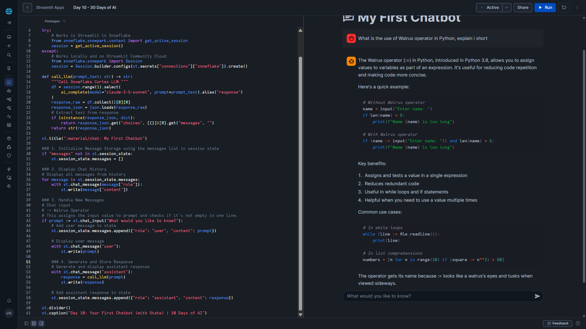

# Day 10 – Your First Chatbot (with State)

This project is part of the **#30DaysOfAI** challenge by Streamlit.

## Goal

Combine everything learned about **chat elements** and **session state** to build a working chatbot that **remembers the conversation** across interactions.

## What this app does

* Renders a visual chat conversation using `st.chat_message`
* Stores messages persistently in `st.session_state`
* Calls Snowflake Cortex (Claude 3.5 Sonnet) to generate AI responses
* Maintains conversation history for the user
* Demonstrates a simple “memory-enabled” chatbot

## Tech Stack

* Python
* Streamlit
* Snowflake Snowpark
* Snowflake Cortex (LLM Inference)
* Claude 3.5 Sonnet

## Key Concept: Stateful Chat with Session State

Streamlit **reruns the script on every user interaction**. Without session state:

* Messages disappear after each input
* Conversation history is lost

`st.session_state` acts as a persistent dictionary to store chat messages. Each message is stored as a dictionary:

```python
{"role": "user" or "assistant", "content": "...message text..."}
```

This is the standard message format used by most modern chat APIs.

## How it Works

### 1. Initialize Message Storage

```python
if "messages" not in st.session_state:
    st.session_state.messages = []
```

* Checks if the `messages` key exists
* Initializes it only once
* Ensures previous messages are preserved across reruns

---

### 2. Display Chat History

```python
for message in st.session_state.messages:
    with st.chat_message(message["role"]):
        st.write(message["content"])
```

* Loops through all stored messages
* Uses `st.chat_message(role)` to render **chat bubbles** correctly for user vs assistant
* Maintains the visual conversation flow

---

### 3. Handle New Messages

```python
if prompt := st.chat_input("What would you like to know?"):
    st.session_state.messages.append({"role": "user", "content": prompt})
```

* Uses the **walrus operator** (`:=`) to capture the input and check it in a single line
* Adds the user message to session state **before displaying it**
* Preserves messages across interactions

---

### 4. Generate and Store Assistant Response

```python
with st.chat_message("assistant"):
    response = call_llm(prompt)
    st.write(response)
st.session_state.messages.append({"role": "assistant", "content": response})
```

* Calls `call_llm(prompt)` which uses **Snowflake Cortex `ai_complete()`**
* Displays the assistant response in the chat bubble
* Stores the response in session state for history

---

### Why SQL-based `ai_complete()`?

* Works across **all environments** (Streamlit in Snowflake, Community Cloud, local)
* Avoids SSL and deployment issues of Python SDK
* Provides a reliable and uniform API for production

---

### What's Missing / Future Improvements

* Loading indicator while waiting for AI response
* Streamed responses instead of displaying all at once
* Clear conversation button
* Message count or insights
* Enhanced styling or personality for chat bubbles
* Error handling for API failures

These will be addressed in future lessons to make a **production-ready chatbot**.

---

## Screenshot


