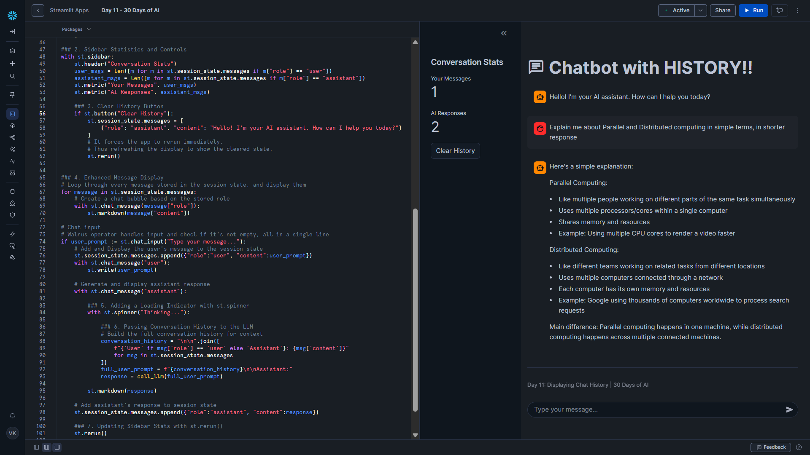

# Day 11 – Displaying Chat History

This project is part of the **#30DaysOfAI** challenge by Streamlit.

## Goal

Enhance the chatbot by adding **true conversation memory**, visible **conversation statistics**, a **welcome message**, and a **clear history** option. The result is a more polished and user-friendly chat experience.

## What this app does

* Displays a welcome message when the app loads
* Stores and displays full chat history using `st.session_state`
* Passes conversation history to the LLM for contextual responses
* Shows real-time conversation statistics in the sidebar
* Allows users to clear chat history and start fresh
* Uses a loading spinner while the AI generates responses

## Tech Stack

* Python
* Streamlit
* Snowflake Snowpark
* Snowflake Cortex (LLM Inference)
* Claude 3.5 Sonnet

## Key Concept: Chat History + Context

In Day 10, messages were **stored and displayed**, but the LLM did not see past messages.
In Day 11, we fix this by **sending the entire conversation history to the LLM** on every request.

This ensures:

* Follow-up questions work correctly
* The chatbot maintains conversational context
* The UI and AI behavior are aligned

## How it Works

### 1. Initialize with a Welcome Message

```python
if "messages" not in st.session_state:
    st.session_state.messages = [
        {"role": "assistant", "content": "Hello! I'm your AI assistant. How can I help you today?"}
    ]
```

* Initializes message storage only once
* Starts the chat with a friendly assistant message
* Makes the chatbot feel more welcoming

---

### 2. Sidebar Statistics and Controls

```python
user_msgs = len([m for m in st.session_state.messages if m["role"] == "user"])
assistant_msgs = len([m for m in st.session_state.messages if m["role"] == "assistant"])
st.metric("Your Messages", user_msgs)
st.metric("AI Responses", assistant_msgs)
```

* Counts messages using list comprehensions
* Displays stats using `st.metric`
* Gives users insight into the conversation

---

### 3. Clear History Button

```python
if st.button("Clear History"):
    st.session_state.messages = [
        {"role": "assistant", "content": "Hello! I'm your AI assistant. How can I help you today?"}
    ]
    st.rerun()
```

* Resets the chat to its initial state
* Uses `st.rerun()` to refresh UI immediately
* Ensures sidebar stats update instantly

---

### 4. Displaying Message History

```python
for message in st.session_state.messages:
    with st.chat_message(message["role"]):
        st.markdown(message["content"])
```

* Renders all messages using chat bubbles
* Uses Markdown for rich formatting
* Preserves the full conversation visually

---

### 5. Loading Indicator with `st.spinner`

```python
with st.spinner("Thinking..."):
    response = call_llm(full_prompt)
```

* Shows visual feedback during LLM processing
* Prevents the UI from feeling frozen
* Improves perceived performance

---

### 6. Passing Full Conversation History to the LLM

```python
conversation = "\n\n".join([
    f"{'User' if msg['role'] == 'user' else 'Assistant'}: {msg['content']}"
    for msg in st.session_state.messages
])
full_prompt = f"{conversation}\n\nAssistant:"
```

* Rebuilds the entire conversation as text
* Adds clear role labels (`User:` / `Assistant:`)
* Sends full context to the LLM for accurate follow-ups

---

### 7. Immediate UI Updates with `st.rerun()`

```python
st.session_state.messages.append({"role": "assistant", "content": response})
st.rerun()
```

* Forces an immediate rerun
* Ensures sidebar stats stay in sync
* Creates a smoother user experience

---

## Key Learning

A chatbot isn’t truly conversational unless:

* The UI remembers messages
* **AND** the LLM sees that history

Day 11 bridges that gap, transforming a basic chat UI into a **context-aware AI assistant**.

## Screenshot


