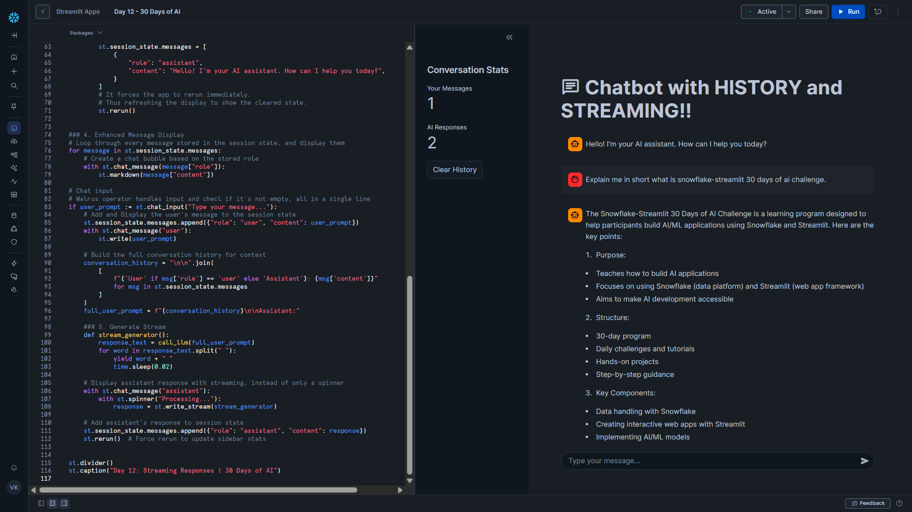

# Day 12 – Streaming Responses

This project is part of the **#30DaysOfAI** challenge by Streamlit.

## Goal

Enhance the chatbot from Day 11 by adding **streaming responses**, providing a **dynamic, real-time chat experience**. Users can now see the AI’s response appear **word-by-word**, mimicking modern chat applications.

## What this app does

* Maintains full conversation history
* Displays a welcome message at start
* Shows conversation statistics in the sidebar
* Allows clearing the chat history
* Generates AI responses in **real-time streaming mode**
* Shows a spinner while the AI generates the response

## Tech Stack

* Python
* Streamlit
* Snowflake Snowpark
* Snowflake Cortex (LLM Inference)
* Claude 3.5 Sonnet

## Key Concept: Streaming Responses

Instead of waiting for the AI to finish generating a full response, we simulate streaming by splitting the response into words and displaying them incrementally. This improves UX by:

* Making the AI feel faster
* Providing visual feedback while generating answers
* Mimicking human-like typing

---

## How it Works

### 1. Initialize Messages with Welcome

```python
if "messages" not in st.session_state:
    st.session_state.messages = [
        {"role": "assistant", "content": "Hello! I'm your AI assistant. How can I help you today?"}
    ]
```

* Starts the chat with a friendly greeting
* Ensures the message list is initialized only once

---

### 2. Sidebar Statistics and Clear History

```python
user_msgs = len([m for m in st.session_state.messages if m["role"] == "user"])
assistant_msgs = len([m for m in st.session_state.messages if m["role"] == "assistant"])
st.metric("Your Messages", user_msgs)
st.metric("AI Responses", assistant_msgs)

if st.button("Clear History"):
    st.session_state.messages = [
        {"role": "assistant", "content": "Hello! I'm your AI assistant. How can I help you today?"}
    ]
    st.rerun()
```

* Counts user and AI messages
* Updates metrics in real-time
* Clears chat history and reruns app to refresh sidebar

---

### 3. Display Chat History

```python
for message in st.session_state.messages:
    with st.chat_message(message["role"]):
        st.markdown(message["content"])
```

* Renders all previous messages in chat bubbles
* Uses Markdown for rich formatting

---

### 4. Streaming AI Responses

```python
conversation = "\n\n".join([
    f"{'User' if msg['role'] == 'user' else 'Assistant'}: {msg['content']}"
    for msg in st.session_state.messages
])
full_prompt = f"{conversation}\n\nAssistant:"

def stream_generator():
    response_text = call_llm(full_prompt)
    for word in response_text.split(" "):
        yield word + " "
        time.sleep(0.02)

with st.chat_message("assistant"):
    with st.spinner("Processing..."):
        response = st.write_stream(stream_generator)

st.session_state.messages.append({"role": "assistant", "content": response})
st.rerun()
```

* Reconstructs full conversation for context
* Uses a generator to yield words one at a time, creating **streaming effect**
* `time.sleep(0.02)` adds a slight delay between words
* `st.write_stream()` updates the chat bubble in real-time
* Stores full response in session state

---

### Key Learning

Streaming responses:

* Improve perceived performance
* Make conversations feel natural
* Provide immediate visual feedback to users

Sidebar metrics update immediately after each response thanks to `st.rerun()`.

This approach combines **conversation memory** + **real-time streaming**, producing a professional, modern chat experience.

---

## Screenshot


