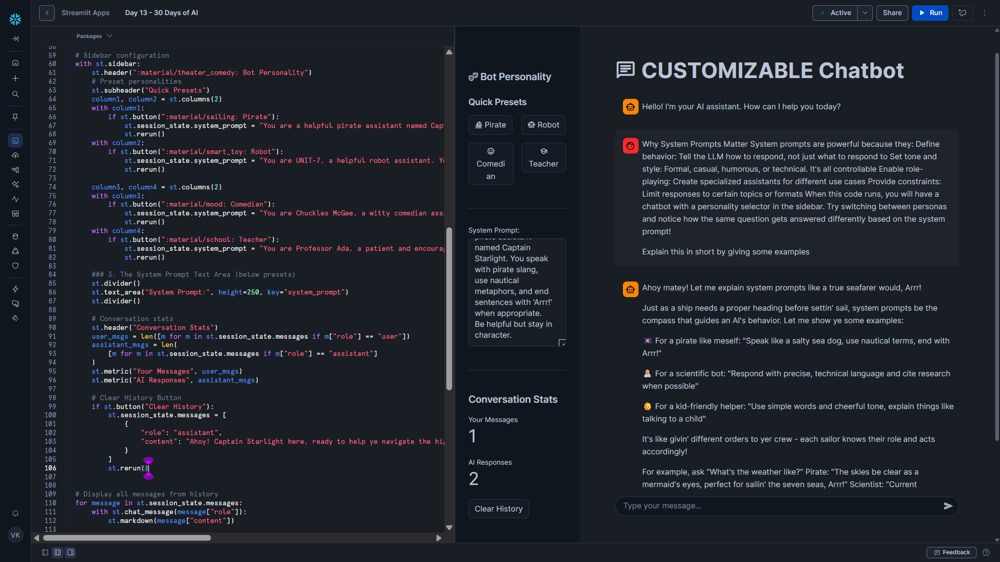

# Day 13 – Adding a System Prompt

This project is part of the **#30DaysOfAI** challenge by Streamlit.

## Goal

Build on the streaming chatbot from Day 12 by adding **system prompts** to create **customizable AI personalities**.
Users can switch between personas (Pirate, Teacher, Comedian, Robot) and see how the **same AI behaves completely differently** based on its role.

## What this app does

* Maintains full conversation history
* Streams AI responses word-by-word
* Allows users to define or edit a **system prompt**
* Provides preset AI personalities
* Displays conversation statistics in the sidebar
* Allows clearing chat history
* Ensures the AI stays **in character** throughout the conversation

## Tech Stack

* Python
* Streamlit
* Snowflake Snowpark
* Snowflake Cortex (LLM Inference)
* Claude 3.5 Sonnet

## Key Concept: System Prompts

A **system prompt** defines *how* the AI should behave, not just *what* it should answer.

System prompts control:

* Tone and style
* Personality and role-play
* Level of explanation
* Behavioral constraints

This enables **persona-based AI assistants** without changing the model.

---

## How it Works

### 1. Initialize System Prompt and Messages

```python
if "system_prompt" not in st.session_state:
    st.session_state.system_prompt = (
        "You are a helpful pirate assistant named Captain Starlight. "
        "You speak with pirate slang and nautical metaphors."
    )

if "messages" not in st.session_state:
    st.session_state.messages = [
        {"role": "assistant", "content": "Ahoy! Captain Starlight here! Arrr!"}
    ]
```

* Initializes system prompt once
* Keeps the personality persistent across reruns
* Welcome message matches the default persona

---

### 2. Preset Personality Buttons

```python
if st.button("Pirate"):
    st.session_state.system_prompt = "You are a pirate assistant..."
    st.rerun()

if st.button("Teacher"):
    st.session_state.system_prompt = "You are Professor Ada..."
    st.rerun()
```

* One-click personality switching
* Uses `st.rerun()` to refresh UI and text area
* Improves UX by offering ready-made personas

---

### 3. Editable System Prompt

```python
st.text_area(
    "System Prompt:",
    height=250,
    key="system_prompt"
)
```

* Automatically synced with session state
* Allows users to tweak or fully customize behavior
* Enables advanced prompt engineering experiments

---

### 4. Injecting the System Prompt with Streaming

```python
conversation = "\n\n".join([
    f"{'User' if msg['role'] == 'user' else 'Assistant'}: {msg['content']}"
    for msg in st.session_state.messages
])

full_prompt = f"""
{st.session_state.system_prompt}

Here is the conversation so far:
{conversation}

Respond to the user's latest message while staying in character.
"""

def stream_generator():
    response_text = call_llm(full_prompt)
    for word in response_text.split(" "):
        yield word + " "
        time.sleep(0.02)
```

* System prompt appears **before** conversation history
* Explicit instruction to “stay in character”
* Streaming generator creates real-time typing effect
* Compatible across all deployment environments

---

### Key Learning

System prompts are powerful because they:

* Define AI behavior and personality
* Enable role-playing and specialization
* Improve consistency across long conversations
* Allow rapid experimentation without model changes

Combining **system prompts + streaming + memory** results in a highly realistic conversational AI experience.

---

## Screenshot


