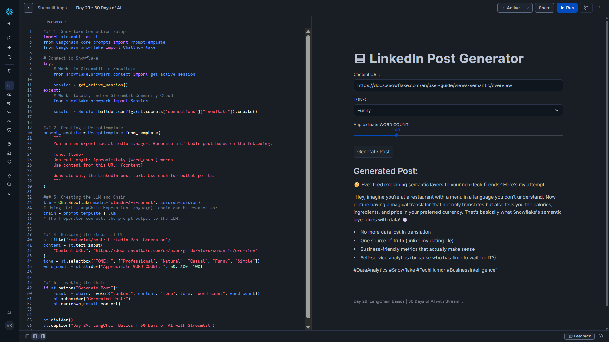

# Day 29 – LangChain Basics (LinkedIn Post Generator)

This project is part of the **#30DaysOfAI** challenge by Streamlit.

## Goal

Rebuild the LinkedIn Post Generator using **LangChain** to make LLM apps cleaner, reusable, and easier to extend.

Instead of raw Cortex API calls and manual JSON parsing, we use:

- PromptTemplate
- LangChain Expression Language (LCEL)
- ChatSnowflake

## What this app does

- Takes a content URL
- Lets you choose tone
- Controls word count
- Generates a LinkedIn post using Snowflake Cortex

## Tech Stack

- Python
- Streamlit
- LangChain
- Snowflake Snowpark
- Snowflake Cortex (LLMs)

## Key Concepts Learned

### PromptTemplate

- Reusable prompts with variables.
- No messy f-strings.

### LCEL (|)

Chain components together:

template | llm

Prompt → LLM → Output

### ChatSnowflake

LangChain wrapper for Snowflake Cortex models.

Lets you call Claude/Mistral/Llama models easily.

## Why LangChain over raw API?

Before (Day 5):

- manual prompt strings
- JSON parsing
- verbose code

Now (Day 29):

- cleaner structure
- reusable templates
- easier chaining
- less boilerplate

Much more production-friendly.

## Project Structure

```
day29_langchain_linkedin_generator/
├── app.py
├── requirements.txt
└── README.md
```

## Installation

Install dependencies:

pip install -r requirements.txt

Or:

pip install langchain-core langchain-snowflake snowflake-snowpark-python streamlit

## Run

streamlit run app.py

## How to Use

1. Enter a content URL
2. Select tone
3. Choose word count
4. Click Generate Post

The app creates a LinkedIn-ready post instantly.

## Key Learning

LangChain makes LLM apps:

- cleaner
- modular
- composable
- easier to maintain

This feels like moving from **“prompt scripting” → “LLM engineering”**.

## Screenshot


