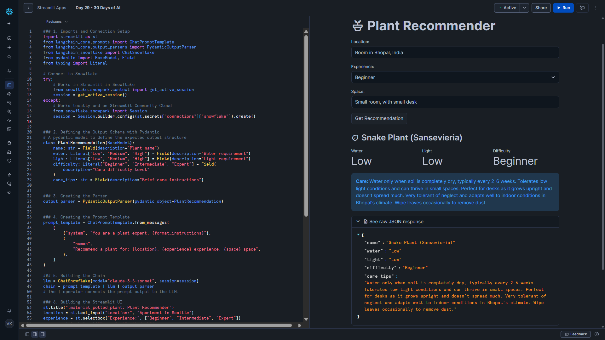

# Day 30 – Structured Output with Pydantic (Plant Recommender)

This project is the final day of **#30DaysOfAI** with Streamlit.

## Goal

Take LangChain apps to the next level using **structured output with Pydantic**.

Instead of plain text responses that require manual parsing, we now:

- Define a **typed schema** with Pydantic
- Parse LLM responses automatically
- Get **type-safe, validated objects** with guaranteed fields
- Display results cleanly in Streamlit

## What this app does

- Takes location, experience level, and space as inputs
- Generates a personalized plant recommendation
- Shows water, light, and difficulty metrics visually
- Provides care tips
- Offers expandable raw JSON response for transparency

## Tech Stack

- Python
- Streamlit
- LangChain
- Snowflake Snowpark & Cortex
- Pydantic (type-safe structured output)

## Key Concepts Learned

### PydanticOutputParser

- Converts LLM output into structured Pydantic objects
- Validates responses against schema
- Provides IDE autocomplete and type safety

### Literal Types

- Restrict fields to exact allowed values (e.g., "Low", "Medium", "High")
- Ensures no unexpected LLM outputs break your app

### ChatPromptTemplate & LCEL

- System + Human message templates
- Chains: `template | llm | parser`
- Clean, composable, reusable

## Benefits over plain text responses

Before (manual parsing):

- ❌ JSON parsing errors
- ❌ No type safety
- ❌ Runtime crashes on missing keys

After (Pydantic structured output):

- ✅ Automatic parsing
- ✅ Guaranteed field types
- ✅ IDE autocomplete
- ✅ Safe, validated data

## Project Structure

```
day30_langchain_pydantic/
├── app.py
├── requirements.txt
└── README.md
````

## Installation

Install dependencies:

```bash
pip install -r requirements.txt
````

Or individually:

```bash
pip install langchain-core langchain-snowflake pydantic snowflake-snowpark-python streamlit
```

## Run

```bash
streamlit run app.py
```

## How to Use

1. Enter location (e.g., "Apartment in Seattle")
2. Choose experience level (Beginner, Intermediate, Expert)
3. Describe your space (e.g., "Small desk")
4. Click **Get Recommendation**

You’ll get a **personalized plant suggestion** instantly with visual metrics and care tips.

## Key Learning

LangChain + Pydantic = clean, type-safe, production-ready LLM apps.

Structured outputs eliminate parsing headaches and make data handling predictable.

---

## Screenshot


